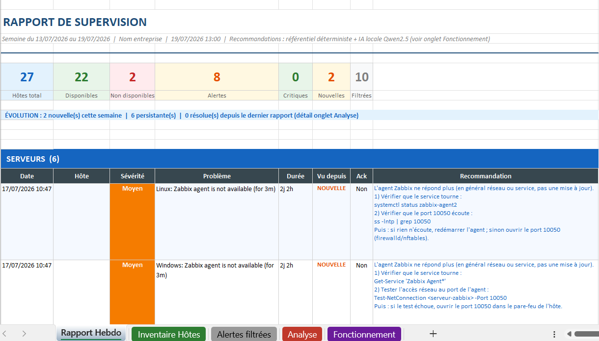
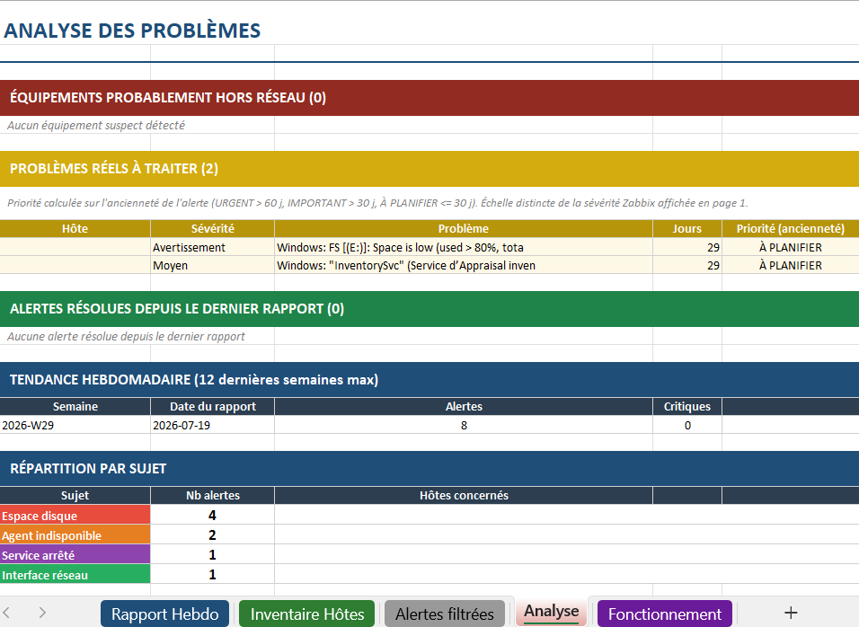
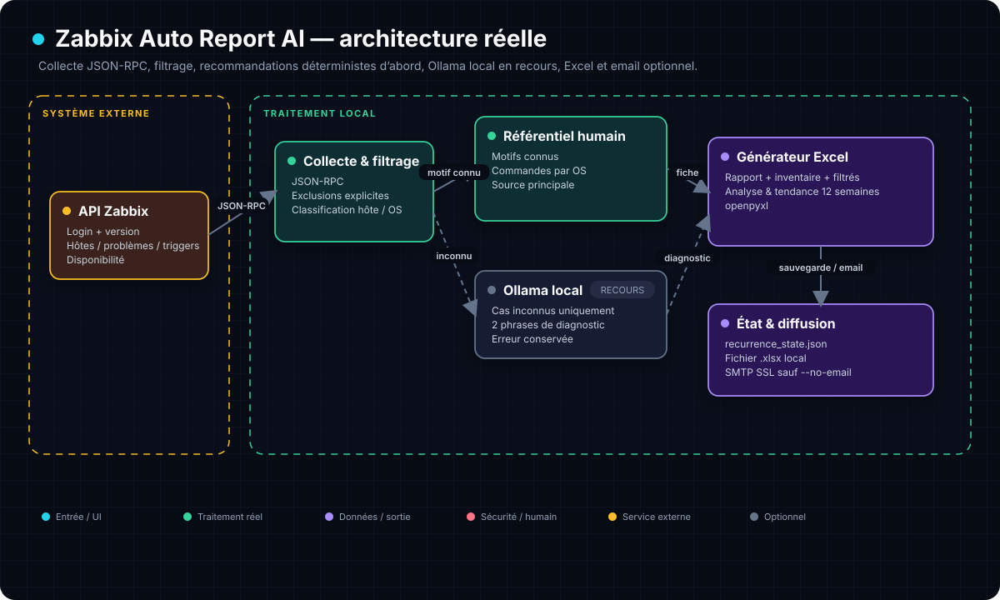

# 📊 Zabbix Auto Report
[](https://github.com/Yukouf/zabbix-auto-report-ai/actions/workflows/security-scan.yml)

> Rapport de supervision hebdomadaire en Excel, généré automatiquement depuis Zabbix, avec recommandations de diagnostic prêtes à l'emploi — sans qu'aucune donnée ne quitte votre serveur.


-6A1B9A)


---

## 🎯 Le problème résolu

Zabbix supervise très bien, mais **personne ne lit une interface de supervision le lundi matin**. Les équipes IT et les managers veulent une réponse simple à trois questions :

1. Qu'est-ce qui est cassé cette semaine ?
2. Est-ce nouveau, ou est-ce que ça traîne depuis un mois ?
3. Qu'est-ce qu'on fait concrètement pour chaque problème ?

Ce script répond aux trois, dans un fichier Excel envoyé par email chaque semaine, lisible aussi bien par un technicien que par un responsable non technique.

---

## 👀 Aperçu

| Page 1 — Rapport hebdo | Onglet Analyse |
|---|---|
|  |  |

*(Captures à partir de données de démonstration.)*

---

## ✨ Ce que contient le rapport

Le fichier Excel généré comporte **5 onglets** :

| Onglet | Contenu |
|---|---|
| **Rapport Hebdo** | Indicateurs clés (hôtes, disponibilité, alertes, critiques, nouvelles), ligne d'évolution vs rapport précédent, puis les alertes classées par catégorie (serveurs, réseau, postes, périphériques) avec sévérité, ancienneté, acquittement et **recommandation de diagnostic** |
| **Inventaire Hôtes** | Tous les hôtes supervisés : IP, groupes, état, disponibilité, type |
| **Alertes filtrées** | Le bruit écarté du rapport (et pourquoi), pour la transparence |
| **Analyse** | Équipements probablement hors réseau, problèmes réels priorisés par ancienneté, **alertes résolues depuis le dernier rapport**, **tendance sur 12 semaines**, répartition par sujet |
| **Fonctionnement** | Explication en français simple, destinée aux non-techniciens, de la façon dont les recommandations sont produites |

### 🔎 Suivi de récurrence

Chaque alerte est suivie de semaine en semaine grâce à un fichier d'état local :

- **NOUVELLE** (en orange) : première apparition cette semaine
- **« 5 sem. »** : l'alerte revient depuis 5 rapports consécutifs — elle traîne
- **Résolue** : présente la semaine dernière, disparue depuis (listée dans l'onglet Analyse)

C'est ce qui transforme une simple liste d'alertes en véritable outil de pilotage : on voit si la situation s'améliore ou se dégrade.

---

## 🧠 Comment sont produites les recommandations

C'est le cœur du projet, et son architecture est volontairement **déterministe d'abord, IA ensuite** :



Le script récupère les hôtes, disponibilités, problèmes et triggers via JSON-RPC. Après filtrage, chaque alerte passe d’abord dans le référentiel humain ; Ollama local n’intervient qu’en l’absence de motif connu. Le classeur et l’état de récurrence sont écrits localement, puis l’envoi SMTP peut être désactivé avec `--no-email`.

### 1. Le référentiel déterministe (source principale)

Une bibliothèque de fiches de réponses **écrites à la main et validées** : disque plein, service arrêté, agent injoignable, machine redémarrée, pression mémoire/CPU, horloge désynchronisée, port réseau tombé, consommable d'imprimante...

Pour chaque alerte, le script :
1. détecte le motif par mots-clés dans le libellé,
2. identifie le système concerné (Windows / Linux / switch) pour donner les bonnes commandes,
3. remplit la fiche avec les vraies valeurs de l'alerte (nom du service, lettre du disque, numéro de port).

Même alerte = toujours la même recommandation. Zéro improvisation.

### 2. L'IA locale (uniquement pour les cas inconnus)

Si aucune fiche ne correspond, le script interroge un modèle **Ollama hébergé sur le serveur lui-même** (Qwen2.5 par défaut). Points clés :

- 🔒 **Aucune donnée ne quitte l'infrastructure** — pas d'API cloud, conforme RGPD
- 🎯 L'OS est **imposé** à l'IA par le script (fini les commandes Linux proposées sur un serveur Windows)
- 🛡️ Consignes strictes : 2 phrases max, diagnostic uniquement, jamais de commande destructrice
- 🧹 La réponse est nettoyée (markdown supprimé, longueur bornée) avant insertion

À chaque exécution, le script affiche la répartition : `12 via référentiel déterministe, 1 via IA locale`. Plus le référentiel s'enrichit, moins l'IA intervient.

---

## 🚀 Installation

### Prérequis

- Python 3.8+
- Un serveur Zabbix 6.0 à 7.x avec un utilisateur API (lecture seule suffit)
- Optionnel : [Ollama](https://ollama.com) installé localement pour les recommandations IA (`ollama pull qwen2.5:7b`)
- Optionnel : un compte SMTP pour l'envoi automatique par email

### Étapes

```bash
# 1. Cloner le dépôt
git clone https://github.com/Yukouf/zabbix-auto-report-ai.git
cd zabbix-auto-report-ai

# 2. Installer la dépendance (unique !)
pip install openpyxl

# 3. Créer votre configuration
cp .env.example .env
nano .env        # renseigner URL Zabbix, identifiants, destinataires...

# 4. Premier test sans envoi d'email
python3 zabbix_auto_report.py --no-email
```

Le rapport `rapport_zabbix_AAAA-MM-JJ.xlsx` est créé dans le dossier configuré.

### Envoi automatique chaque semaine (cron)

```bash
crontab -e
# Tous les lundis à 8h00 :
0 8 * * 1 /usr/bin/python3 /chemin/vers/zabbix_auto_report.py
```

---

## ⚙️ Configuration

Tout se configure dans le fichier `.env` (jamais dans le code) :

| Variable | Rôle | Exemple |
|---|---|---|
| `ZABBIX_URL` | URL de l'API Zabbix | `https://zabbix.mondomaine.local/api_jsonrpc.php` |
| `ZABBIX_USER` / `ZABBIX_PASS` | Utilisateur API (lecture seule) | `rapport-auto` |
| `VERIFY_SSL` | `true` si certificat valide, `false` si auto-signé | `false` |
| `SMTP_SERVER` / `SMTP_PORT` | Serveur d'envoi (SSL) | `smtp.mondomaine.com` / `465` |
| `SMTP_USER` / `SMTP_PASS` | Compte SMTP | |
| `SMTP_FROM` / `SMTP_SENDER` | Expéditeur affiché / adresse d'envoi | |
| `EMAIL_TO` | Destinataires, séparés par des virgules | `it@acme.com,manager@acme.com` |
| `COMPANY_NAME` | Nom affiché en en-tête du rapport | `ACME Corp` |
| `REPORT_DIR` | Dossier de sortie des rapports | `/opt/rapports` |
| `OLLAMA_URL` / `OLLAMA_MODEL` | IA locale (optionnelle) | `http://127.0.0.1:11434/api/generate` / `qwen2.5:7b` |
| `NETWORK_KEYWORDS` | Mots-clés identifiant vos switches (noms d'hôtes) | `aruba,cisco,switch` |
| `EXCLUDED_PATTERNS` | Motifs d'alertes à filtrer, séparés par `;` | |

💡 **Sans Ollama, le script fonctionne quand même** : le référentiel couvre les alertes courantes, et les cas inconnus afficheront simplement une erreur IA dans la colonne recommandation.

---

## 🧩 Adapter le référentiel à votre parc

Les fiches de réponses sont dans la variable `COMMAND_TABLE` du script. Chaque fiche = des mots-clés de détection + une réponse par type d'OS :

```python
{   # Exemple : certificat expiré
    "patterns": ["certificate", "cert expires"],
    "commands": {
        "Linux": "Le certificat arrive à expiration.\n1) Vérifier la date :\nopenssl x509 -enddate -noout -in <chemin>\nPuis : renouveler avant l'échéance.",
    },
},
```

Ajoutez vos propres fiches au fil des alertes rencontrées : c'est ainsi que le rapport devient de plus en plus autonome.

---

## 🔐 Sécurité et confidentialité

- **Aucun identifiant dans le code** : tout passe par `.env` (ignoré par git)
- **Utilisateur Zabbix en lecture seule** recommandé
- **IA 100 % locale** : les libellés d'alertes (qui contiennent des noms d'hôtes internes) ne sont jamais envoyés à un service tiers
- Le fichier d'état `recurrence_state.json` et les rapports générés sont exclus du dépôt

---

## 🛠️ Choix techniques

| Choix | Pourquoi |
|---|---|
| Bibliothèque standard Python + openpyxl seul | Déploiement trivial sur un serveur de production, pas de chaîne de dépendances à auditer |
| Référentiel avant IA | Fiabilité et reproductibilité d'abord ; l'IA est un filet, pas un pilote |
| Compatibilité API 6.0 → 7.x | Détection automatique de version (`selectGroups` vs `selectHostGroups`) |
| Fichier d'état JSON local | Suivi de récurrence sans base de données |
| Compteur par semaine ISO | Relancer le script plusieurs fois dans la semaine ne fausse pas les statistiques |

---

## 👤 Auteur

**Youssef Guerniou** — [github.com/Yukouf](https://github.com/Yukouf)

Projet développé dans le cadre d'un déploiement SOC/supervision en production. Voir aussi : [Wazuh-CVE-Alerter](https://github.com/Yukouf/wazuh-cve-alerter-mail).

## 📄 Licence

MIT — libre d'utilisation, y compris en entreprise.
